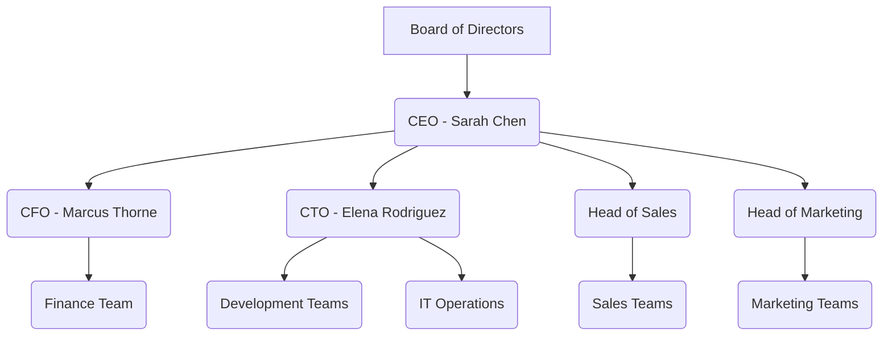

# Lab 5: Information Security Governance in Action

**Course:** GRC102 - Information Security Governance  
**Week:** 5  
**Duration:** 5 Days (Self-Paced)  
**Level:** Intermediate

---

## Welcome to GlobalHealth Connect

Welcome to your new role as the **Director of Information Security Governance** at **GlobalHealth Connect (GHC)**, a mid-sized health technology company that provides cloud-based patient management systems to clinics across the country. GHC is at a critical juncture. After a period of rapid growth and the recent acquisition of two smaller startups, our security posture has been described as "ad-hoc." A recent near-miss—a minor data leak that was thankfully contained—has focused the Board of Directors' attention squarely on our information security program.

This week, you will not be working in a terminal or a command line. Instead, you will step into a real-world scenario where you will interact with company stakeholders, analyze business documents, and build a robust security governance framework from the ground up. Your mission is to transform GHC's reactive security approach into a proactive, business-aligned governance program.

### Your Key Stakeholders

You will need to work with a variety of senior leaders at GHC, each with their own priorities and concerns. Building consensus will be as important as developing technically sound policies.

| Name             | Role | Key Concerns                                       |
|------------------|------|----------------------------------------------------|
| **Sarah Chen**   | CEO  | Growth, market reputation, operational efficiency. |
| **Marcus Thorne**| CFO  | Return on investment (ROI), compliance costs, risk.|
| **Elena Rodriguez**| CTO  | Developer productivity, technical debt, innovation.|
| **David Miller** | Board| Accountability, clear metrics, regulatory compliance.|

### Learning Objectives

By the end of this lab, you will have tangible experience in:

- Designing a security governance structure that fits a business context.
- Authoring a formal Security Charter to provide a mandate for the security program.
- Developing and presenting executive-level security metrics for a Board of Directors.
- Establishing the framework for a Security Steering Committee to ensure cross-functional alignment.
- Assessing the maturity of a security governance program and creating a strategic roadmap for improvement.

---

## Task 1: The Governance Blueprint (Day 1)

**Scenario:** Sarah Chen, our CEO, has just sent you an urgent email. She acknowledges the recent data leak near-miss and states, "We need a formal security structure, and we need it yesterday. I need you to design an organizational security governance structure with clear roles and responsibilities. Show me where security governance fits within GHC."

**Your Mission:** Design a security governance structure for GHC. This involves defining key roles, responsibilities, and how security decision-making will be integrated into the company.

### Activity: Reviewing the Current State and CEO's Request

Before you can design, you need to understand. Review the following:

1.  **Email from the CEO:** Read Sarah Chen's email to understand her expectations and urgency.
2.  **Draft GHC Organizational Chart:** Examine the current, informal organizational structure.
3.  **Current Staff List:** Understand the existing personnel and their current roles.

---

### Email from the CEO (Sarah Chen)

**Subject:** URGENT: Security Governance Structure Needed ASAP
**From:** Sarah Chen <sarah.chen@ghc.com>
**To:** [Your Name], Director of Information Security Governance
**Date:** March 1, 2026

Dear [Your Name],

Welcome aboard! I know you've just started, but we have an immediate and critical need. The recent data leak near-miss has put security governance at the top of the Board's agenda. Frankly, our current approach is ad-hoc, and that's no longer sustainable with our growth and recent acquisitions.

I need you to design a formal organizational security governance structure. This includes defining clear roles and responsibilities for security decision-making and oversight. I want to see where security governance fits within our overall GHC structure. Think about who needs to be involved, what their responsibilities are, and how we ensure accountability.

I'm looking for a clear, actionable plan. Let's get this right.

Best regards,

Sarah Chen
CEO, GlobalHealth Connect

---

### Draft GHC Organizational Chart (Simplified)



---

### Current Staff List (Excerpt)

| Employee Name    | Current Role             | Department        | Notes                                     |
|------------------|--------------------------|-------------------|-------------------------------------------|
| John Smith       | IT Manager               | IT Operations     | Manages infrastructure, some security tasks. |
| Jane Doe         | Senior Developer         | Development       | Leads a key product development team.     |
| Mark Johnson     | Compliance Officer       | Legal & Compliance| Focuses on healthcare regulations.        |
| Emily White      | Data Analyst             | Finance           | Handles sensitive financial data.         |
| Robert Green     | HR Manager               | Human Resources   | Manages employee onboarding/offboarding.  |

---

### Your Deliverables for Task 1

Based on the scenario and provided information, create the following:

1.  **Proposed Security Governance Organizational Chart:** A revised organizational chart (you can use a simple text-based or Mermaid diagram like the example above) that clearly shows where the Information Security Governance function sits and its relationship to other departments and leadership.
2.  **RACI Matrix (Responsible, Accountable, Consulted, Informed):** For at least three key security governance activities (e.g., "Policy Approval," "Risk Assessment Review," "Security Incident Response Planning"), define the RACI roles for relevant GHC stakeholders. Use the provided staff list and your understanding of typical organizational roles.

**Guidance:**

*   Consider the principles of good governance: accountability, transparency, effectiveness, and risk management.
*   Think about how to integrate security into existing business processes rather than creating a separate silo.
*   Your proposed structure should support GHC's growth while addressing the CEO's concerns.

## Task 2: The Security Charter (Day 2)

**Scenario:** Following your initial work on the governance structure, Sarah Chen is pleased. However, Marcus Thorne, the CFO, has raised a point: "The Board needs a formal mandate for this security program. Something that clearly outlines its purpose, authority, and scope. We can't just spend money without a clear directive." David Miller, the Board Member, agrees, emphasizing the need for a document that can be formally approved and referenced.

**Your Mission:** Develop a formal **Information Security Charter** for GlobalHealth Connect. This document will serve as the foundational mandate for the entire information security program, defining its purpose, scope, authority, and key components.

### Activity: Drafting the Security Charter

Review the provided excerpts from GHC's strategic goals and use the Security Charter Template to draft GHC's official Information Security Charter. Remember to tailor it to GHC's specific context and the concerns of the stakeholders.

---

### Excerpts from GHC Strategic Goals 2026

*   **Goal 1: Expand Market Share:** Increase client base by 25% through new product features and entry into two new regional markets.
*   **Goal 2: Enhance Operational Efficiency:** Streamline internal processes, reduce overhead by 10%, and improve system uptime to 99.99%.
*   **Goal 3: Maintain Customer Trust:** Ensure the highest level of data privacy and security for patient information, aiming for zero major data breaches.
*   **Goal 4: Foster Innovation:** Invest in R&D for AI-driven diagnostic tools and secure data exchange platforms.
*   **Goal 5: Achieve Regulatory Excellence:** Proactively meet and exceed compliance requirements for HIPAA, GDPR, and other relevant healthcare data regulations.

---

### Information Security Charter Template

```markdown
# GlobalHealth Connect Information Security Charter

## 1. Purpose
[State the primary reason for the Information Security Program and this Charter. Why is security important to GHC?]

## 2. Scope
[Define what the Information Security Program covers. What assets, systems, data, and personnel are included?]

## 3. Authority
[Establish the authority of the Information Security Program and the Director of Information Security Governance. Who grants this authority? What powers does it have?]

## 4. Roles and Responsibilities
[Outline high-level roles and responsibilities related to information security governance within GHC. Reference the structure you designed in Task 1.]

## 5. Key Principles
[List the core principles that will guide GHC's information security efforts (e.g., risk-based, continuous improvement, business alignment).]

## 6. Reporting Structure
[Describe how the Information Security Program reports to senior management and the Board of Directors.]

## 7. Review and Approval
[Specify how and when this Charter will be reviewed and by whom it must be approved.]

---

**Effective Date:** [Date of Charter Approval]
**Approved By:** Sarah Chen, CEO
```

---

### Your Deliverables for Task 2

1.  **Completed GHC Information Security Charter:** A fully drafted charter document, using the template provided, tailored to GlobalHealth Connect.
2.  **Justification Memo:** A brief memo (1-2 paragraphs) to Marcus Thorne (CFO) explaining how the proposed charter aligns with GHC's strategic goals and addresses his concerns about clear directives and accountability.
## Task 3: Board Reporting and Metrics (Day 3)

**Scenario:** Your first Board meeting is in two days. David Miller, the Board Member with an audit background, has specifically requested a concise, data-driven update on the current security posture. "I don't want technical jargon," he said. "I want to understand our risk in business terms. Show me the numbers that matter."

**Your Mission:** Analyze a set of raw security data from the last six months and develop a clear, executive-level security report for the Board of Directors. Your report should highlight key metrics, provide context, and offer a clear status assessment.

### Activity: From Raw Data to Board-Ready Insights

Review the provided "Raw Security Data Table" and select the most critical metrics to present to the Board. You will then use the "Board Executive Summary Template" to create a compelling and easy-to-understand report.

---

### Raw Security Data Table (Last 6 Months)

| Month       | Phishing Attempts | Malware Detections | Critical Vulnerabilities Patched | Patching Compliance | Security Training Completion | High-Risk Incidents |
|-------------|-------------------|--------------------|--------------------------------|---------------------|------------------------------|---------------------|
| September   | 150               | 25                 | 10 of 15                       | 67%                 | 45%                          | 2                   |
| October     | 180               | 30                 | 12 of 20                       | 60%                 | 50%                          | 3                   |
| November    | 210               | 35                 | 15 of 25                       | 60%                 | 55%                          | 4                   |
| December    | 250               | 40                 | 18 of 30                       | 60%                 | 60%                          | 5                   |
| January     | 280               | 45                 | 20 of 35                       | 57%                 | 65%                          | 6                   |
| February    | 320               | 50                 | 22 of 40                       | 55%                 | 70%                          | 7                   |

---

### Board Executive Summary Template

```markdown
# Information Security Report - Board of Directors

**Reporting Period:** [Start Date] - [End Date]
**Prepared By:** [Your Name], Director of Information Security Governance

## 1. Overall Security Posture: RED

[Provide a brief, high-level summary of the current security posture. Explain why you have assigned the current RAG (Red, Amber, Green) status.]

## 2. Key Security Metrics

| Metric                       | Current Status | Trend (Last 6 Months) | Commentary                                                              |
|------------------------------|----------------|-----------------------|---------------------------------------------------------------------------|
| **[Selected Metric 1]**      | [Value]        | [Up/Down/Flat]        | [Briefly explain what this metric means and why it is important.]         |
| **[Selected Metric 2]**      | [Value]        | [Up/Down/Flat]        | [Briefly explain what this metric means and why it is important.]         |
| **[Selected Metric 3]**      | [Value]        | [Up/Down/Flat]        | [Briefly explain what this metric means and why it is important.]         |
| **[Selected Metric 4]**      | [Value]        | [Up/Down/Flat]        | [Briefly explain what this metric means and why it is important.]         |
| **[Selected Metric 5]**      | [Value]        | [Up/Down/Flat]        | [Briefly explain what this metric means and why it is important.]         |

## 3. Key Risks and Issues

*   **[Risk/Issue 1]:** [Briefly describe a key risk or issue identified from the data.]
*   **[Risk/Issue 2]:** [Briefly describe a key risk or issue identified from the data.]

## 4. Recommendations

*   **[Recommendation 1]:** [Propose a specific, actionable recommendation to address a key risk or issue.]
*   **[Recommendation 2]:** [Propose a specific, actionable recommendation to address a key risk or issue.]
```

---

### Your Deliverables for Task 3

1.  **Completed Board Executive Summary:** A one-page report, using the provided template, that is ready for the Board of Directors. You must select the most impactful metrics from the raw data, determine the trend, and provide concise commentary.
2.  **Rationale for Metric Selection:** A short paragraph explaining why you chose your five key metrics and what they collectively represent about GHC's security posture.
## Task 4: The Security Steering Committee (Day 4)

**Scenario:** A conflict has arisen between Elena Rodriguez (CTO) and John Smith (IT Manager) regarding the implementation of a new password policy. Elena believes it will hinder developer productivity, while John insists it's a critical security control. Sarah Chen (CEO) has stepped in, stating, "This is exactly why we need a formal body to resolve these issues and ensure alignment. We need a Security Steering Committee (SSC)."

**Your Mission:** Design the framework for GHC's **Security Steering Committee (SSC)**. This includes defining its purpose, membership, meeting cadence, and responsibilities to ensure cross-functional alignment and effective security decision-making.

### Activity: Structuring the SSC

Review the "Conflict Memo" from the CTO and then use the provided template to draft the SSC Terms of Reference (ToR) and a sample meeting agenda. Consider how the SSC can effectively mediate such conflicts and drive security initiatives.

---

### Conflict Memo from the CTO (Elena Rodriguez)

**Subject:** Concerns Regarding Proposed Password Policy
**From:** Elena Rodriguez <elena.rodriguez@ghc.com>
**To:** [Your Name], Director of Information Security Governance
**Cc:** John Smith, IT Manager
**Date:** March 4, 2026

Dear [Your Name],

I'm writing to express significant concerns about the new password policy proposed by IT. While I understand the intent to enhance security, the requirement for 16-character complex passwords, changed every 30 days, with no password manager integration, is simply unworkable for my development teams. It will lead to increased friction, password fatigue, and ultimately, shadow IT solutions, which will *decrease* our overall security posture.

My teams are already under pressure to deliver new features, and this policy will severely impact their productivity. We need security that enables, not hinders, our innovation. I believe a more balanced approach is necessary, perhaps focusing on multi-factor authentication and secure password managers rather than arbitrary complexity and frequent changes.

I hope we can discuss this further and find a more pragmatic solution.

Best regards,

Elena Rodriguez
CTO, GlobalHealth Connect

---

### Security Steering Committee (SSC) Terms of Reference (ToR) Template

```markdown
# GlobalHealth Connect Security Steering Committee (SSC) Terms of Reference

## 1. Purpose
[Clearly state the primary objective and mandate of the SSC. Why does it exist?]

## 2. Scope
[Define the areas and topics the SSC will oversee and make decisions on. What is within its purview?]

## 3. Membership
[List the key roles or individuals who will be members of the SSC. Consider representation from different departments.]

## 4. Roles and Responsibilities of Members
[Outline the general duties and expectations of SSC members.]

## 5. Meeting Cadence and Logistics
[Specify how often the SSC will meet, who will chair the meetings, and how minutes will be recorded and distributed.]

## 6. Decision-Making Authority
[Describe the level of authority the SSC has in making security-related decisions and how conflicts will be resolved.]

## 7. Reporting
[Explain how the SSC will report its activities and decisions to the Board and other stakeholders.]

---

### Sample Security Steering Committee Meeting Agenda Template

```markdown
# GlobalHealth Connect Security Steering Committee - Sample Meeting Agenda

**Date:** [Date]
**Time:** [Time]
**Location:** [Location/Virtual]
**Chair:** [Chairperson]
**Attendees:** [List of expected attendees]

## 1. Welcome and Introductions (5 min)

## 2. Review and Approval of Previous Meeting Minutes (5 min)

## 3. Action Items Review (10 min)
    *   Review status of open action items from previous meetings.

## 4. Strategic Security Updates (15 min)
    *   Brief update on overall security posture and key initiatives.

## 5. Key Discussion Topics (30 min)
    *   **Discussion Item 1:** Proposed Password Policy Review (Addressing CTO's concerns).
    *   **Discussion Item 2:** [Another relevant security topic, e.g., budget request, new project security review].

## 6. Risk Register Review (15 min)
    *   Review top organizational security risks and mitigation progress.

## 7. New Business / Open Forum (10 min)

## 8. Action Items and Next Steps (5 min)
    *   Assign new action items and set deadlines.

## 9. Adjournment
```

---

### Your Deliverables for Task 4

1.  **Completed SSC Terms of Reference (ToR):** A drafted ToR document for the GlobalHealth Connect Security Steering Committee, using the provided template.
2.  **Sample SSC Meeting Agenda:** A sample agenda for the first SSC meeting, incorporating the password policy conflict as a key discussion item and demonstrating how the SSC would operate.
3.  **Briefing Note:** A short briefing note (1-2 paragraphs) to Sarah Chen (CEO) explaining how the SSC will help resolve cross-departmental conflicts like the password policy issue and ensure strategic alignment.
## Task 5: Governance Maturity Assessment (Day 5)

**Scenario:** David Miller, the Board Member, has approached you again. "It's great that we're putting these structures in place," he said, "but how do we know if we're actually improving? Where do we stand compared to our peers, and what's our roadmap to getting better?" Elena Rodriguez (CTO) also expressed interest, asking, "Can we get a clear picture of our current capabilities so I can prioritize technical improvements?"

**Your Mission:** Assess GlobalHealth Connect's current security governance maturity using a simplified maturity model. Based on this assessment, you will propose a roadmap for improvement.

### Activity: Assessing and Improving Maturity

Review the "Current State Interview Summary" which provides insights into GHC's security practices. Then, use the "Simplified Maturity Scoring Tool" to assess GHC's maturity across key governance domains. Finally, outline a roadmap for improvement.

---

### Current State Interview Summary (Excerpts)

*   **Policy & Documentation:** "We have some policies, mostly inherited from acquired companies. They're not always consistent or up-to-date." (IT Manager)
*   **Roles & Responsibilities:** "Everyone knows security is important, but who actually *owns* what? It's a bit fuzzy." (HR Manager)
*   **Risk Management:** "We react to incidents, but proactive risk assessments? Not really a formal process." (CFO)
*   **Metrics & Reporting:** "We track a lot of technical metrics, but translating them into business impact for the Board is a challenge." (Director of InfoSec Governance - *your predecessor*)
*   **Training & Awareness:** "Annual training is mandatory, but engagement is low. It feels like a checkbox exercise." (HR Manager)
*   **Compliance:** "We scramble when auditors come, but continuous compliance monitoring is still a work in progress." (Compliance Officer)

---

### Simplified Maturity Scoring Tool (Based on NIST CSF / ISO 27001 Principles)

Use the following 1-5 scale to score GHC's current maturity in each domain based on the interview summary:

*   **Level 1 (Ad Hoc):** Activities are informal, reactive, and inconsistent. No defined processes.
*   **Level 2 (Initial):** Some processes are defined, but they are often undocumented and inconsistently applied. Dependent on individuals.
*   **Level 3 (Defined):** Processes are documented, standardized, and communicated. Roles and responsibilities are generally clear.
*   **Level 4 (Managed):** Processes are measured, monitored, and regularly reviewed for effectiveness. Performance targets are set.
*   **Level 5 (Optimizing):** Continuous improvement is embedded. Processes are optimized, innovative, and adapt quickly to changing threats.

| Governance Domain          | Current Maturity Score (1-5) | Justification (Based on Interview Summary) |
|----------------------------|------------------------------|--------------------------------------------|
| Policy & Documentation     |                              |                                            |
| Roles & Responsibilities   |                              |                                            |
| Risk Management            |                              |                                            |
| Metrics & Reporting        |                              |                                            |
| Training & Awareness       |                              |                                            |
| Compliance                 |                              |                                            |

---

### Your Deliverables for Task 5

1.  **Completed Maturity Assessment Table:** Fill in the "Current Maturity Score" and "Justification" columns in the table above based on the "Current State Interview Summary."
2.  **Maturity Roadmap:** Outline a brief, actionable roadmap (3-5 key initiatives) for GHC to achieve Level 3 maturity across all domains within the next 12-18 months. For each initiative, specify:
    *   **Initiative:** (e.g., "Develop and approve a comprehensive Information Security Policy Suite")
    *   **Objective:** (What will this initiative achieve?)
    *   **Key Activities:** (What steps are involved?)
    *   **Expected Outcome:** (What will be the measurable result?)
3.  **Executive Summary of Assessment:** A short summary (1-2 paragraphs) for David Miller (Board Member) explaining the current maturity state and the strategic importance of the proposed roadmap.

---

## Submission Requirements

Upon completion of all tasks, please submit a single Markdown file (`Interactive_Lab_GRC102_W5_Submission_[YourName].md`) containing all your deliverables. Ensure your submission is well-organized, clearly labeled, and professionally presented. Your submission should include:

*   Your proposed Security Governance Organizational Chart (Task 1)
*   Your completed RACI Matrix (Task 1)
*   Your completed GHC Information Security Charter (Task 2)
*   Your Justification Memo to Marcus Thorne (Task 2)
*   Your completed Board Executive Summary (Task 3)
*   Your Rationale for Metric Selection (Task 3)
*   Your completed SSC Terms of Reference (ToR) (Task 4)
*   Your Sample SSC Meeting Agenda (Task 4)
*   Your Briefing Note to Sarah Chen (Task 4)
*   Your completed Maturity Assessment Table (Task 5)
*   Your Maturity Roadmap (Task 5)
*   Your Executive Summary of Assessment (Task 5)

**Note:** You do not need to create separate files for each deliverable; embed them directly into your single Markdown submission file. Use clear headings and formatting to distinguish between tasks and deliverables.

---

## Assessment Criteria

Your lab will be assessed on:

| Criterion               | Weight | Description                                                              |
|-------------------------|--------|--------------------------------------------------------------------------|
| **Completeness**        | 20%    | All tasks completed with required deliverables.                          |
| **Clarity & Coherence** | 25%    | Clear, logical flow of ideas; easy to understand.                        |
| **Strategic Alignment** | 20%    | Deliverables align with GHC's business context and stakeholder concerns. |
| **Critical Thinking**   | 20%    | Depth of analysis, justification of decisions, and practical solutions.  |
| **Professionalism**     | 15%    | Organization, formatting, grammar, and overall presentation.             |

---

## Resources

*   **GHC Company Profile:** (Provided in the scenario description)
*   **Regulatory Context:** (HIPAA, GDPR - general knowledge required; specific details embedded in scenario)
*   **Glossary of Governance Terms:** (Students encouraged to research as needed)

---

**Lab Created:** March 2026  
**Last Updated:** March 2026  
**Author:** Aminu Idris, AMCPN  
**Version:** 2.0 (Interactive Scenario Edition)

---

## Appendix A: GHC Company Profile & Context

**GlobalHealth Connect (GHC)** is a leading provider of cloud-based patient management systems, serving over 500 clinics and healthcare providers. Our platform handles highly sensitive Protected Health Information (PHI), making security and privacy our top priorities.

**Key Business Drivers:**
*   **Trust:** Our reputation is built on the security of patient data.
*   **Compliance:** We must adhere to HIPAA (US), GDPR (EU), and various state-level health data regulations.
*   **Innovation:** We are constantly developing new features, including AI-driven diagnostics and secure telehealth integrations.
*   **Growth:** We are actively expanding through organic growth and strategic acquisitions.

## Appendix B: Regulatory Requirements (Summary)

| Regulation | Scope | Key Requirements for GHC |
|------------|-------|--------------------------|
| **HIPAA**  | US Health Data | Administrative, Physical, and Technical Safeguards for PHI. |
| **GDPR**   | EU Citizen Data | Data protection by design, breach notification, and data subject rights. |
| **HITECH** | US Health IT | Enhanced enforcement and breach notification requirements for HIPAA. |

## Appendix C: Glossary of Governance Terms

*   **Governance:** The system by which an organization is directed and controlled.
*   **Policy:** A high-level statement of intent and direction.
*   **Standard:** A mandatory requirement or specification.
*   **Procedure:** A step-by-step set of instructions for performing a task.
*   **RACI:** A matrix used to assign roles and responsibilities (Responsible, Accountable, Consulted, Informed).
*   **Steering Committee:** A cross-functional group that provides strategic direction and oversight.
*   **Maturity Model:** A framework for assessing the effectiveness and sophistication of a process or program.
